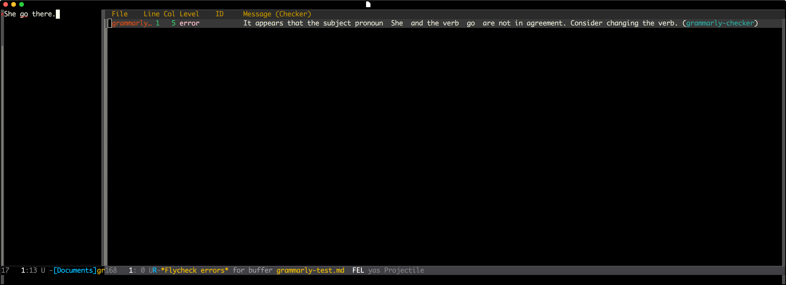

# flycheck-grammarly
> Grammarly support for Flycheck.

# Get started

    (require 'grammarly)
    (require 'flycheck-grammarly)
    (add-hook 'markdown-mode-hook 'flyspell-grammarly)

## Todo List

- [ ] Strip only text data, if other data like `# header` or `> quote` will return nothing.
- [ ] Usable but not fast enough, really depends on Grammarly's analyzer.

## Contribution

If you would like to contribute to this project, you may either
clone and make pull requests to this repository. Or you can
clone the project and establish your own branch of this tool.
Any methods are welcome!
